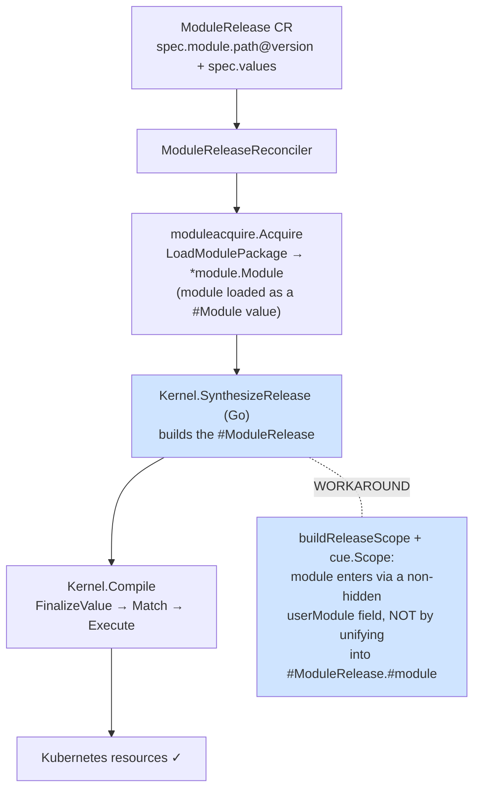
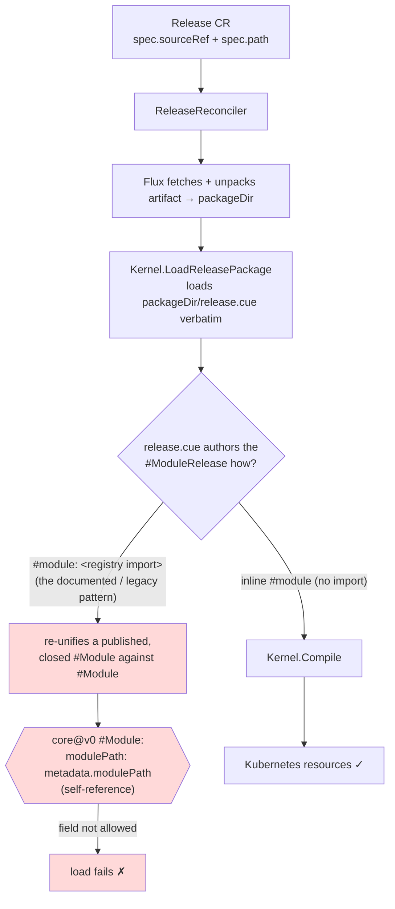

# Release vs ModuleRelease: render-path divergence and the imported-module closedness failure

Status: Known issue / investigation (2026-06-16). Affects `Release` CRs whose
`release.cue` imports a published `#Module`. Does **not** affect `ModuleRelease`.

## Summary

The operator has two independent entry points into the same render pipeline:

- **`ModuleRelease`** — names a published module by registry path + version; the
  controller synthesizes the `#ModuleRelease` **in Go** and compiles it.
- **`Release`** — points Flux at a CUE package whose `release.cue` is an
  **author-written** `#ModuleRelease`; the controller loads and compiles it.

Both work for trivial cases, but the `Release` path **fails to load any
`release.cue` that imports a published module** the way the documented pattern
intends (`#module: <registry import>`). On `opmodel.dev/core@v0` the load aborts
with:

```
#module.metadata.modulePath: field not allowed
#module.metadata.version:    field not allowed
```

The `ModuleRelease` path renders the same modules without complaint. The two
paths diverged on 2026-04-17 (two changes landed the same day) and the `Release`
path was never re-validated against `core@v0` after the schema migration — its
only fixture is still on the retired `core/v1alpha1` schema, and no test renders
a real imported module through it.

## The two paths

### ModuleRelease (registry-native, Go-synthesized)



Code: `internal/render/kernel_module_renderer.go` →
`internal/moduleacquire/acquire.go` → library `opm/helper/synth.Release` →
`opm/kernel.Kernel.Compile`.

### Release (Flux source + authored release.cue)



Code: `internal/render/kernel_release_renderer.go` → library
`opm/helper/loader/file.LoadReleasePackage` → `opm/kernel.Kernel.Compile`.

The divergence point is the box that turns CR fields into a `#ModuleRelease`
value: **Go-side `SynthesizeRelease` (ModuleRelease) vs. author-written CUE
loaded as-is (Release)**. Everything downstream (`Compile` → `FinalizeValue` →
match → execute) is shared.

## Root cause

`opmodel.dev/core@v0`'s `#Module` declares its identity fields self-referentially
(`core/src/module.cue`):

```cue
metadata: {
    name!: #NameType
    modulePath: metadata.modulePath                                 // line 14 — self-reference
    version:    metadata.version                                    // line 15
    fqn:        #ModuleFQNType & "\(modulePath)/\(name):\(version)" // line 16 — interpolates the above
    uuid:       #UUIDType & cue_uuid.SHA1(OPMNamespace, fqn)
}
```

`#ModuleRelease` then demands `#module!: #Module & {#ctx: release: …}`
(`core/src/module_release.cue`). So an author-written
`#module: <imported published #Module>` unifies an already-closed `#Module`
instance against `#Module` a second time. CUE re-admits the imported module's
concrete `metadata.modulePath` / `version` against a freshly re-evaluated
`#Module` whose self-references resolve to bottom, and rejects them as **"field
not allowed."** This is independent of the module's contents (stateless or
stateful both fail) and independent of the published version — confirmed by
re-publishing current source into an empty `CUE_CACHE_DIR` and re-running
`cue eval`.

The library authors already knew about this. `synth.Release`
(`opm/helper/synth/release.go`) carries the fix and an explicit comment naming
the exact failure:

> CUE's Go API rejects FillPath into a closed definition when the definition
> uses self-referential constraints (`#Module` in `opmodel.dev/core@v0` declares
> `modulePath: metadata.modulePath`). Filling a separately-built module value
> into `#ModuleRelease.#module` triggers admission checks against a re-evaluated
> copy of `#Module` where the self-reference resolves to bottom, so
> caller-supplied modulePath / version are rejected as "field not allowed".
>
> Workaround: build a scope value that extends the schema package with a
> non-hidden `userModule` field, fill the caller's module into that field, then
> compile a release expression that references both `#ModuleRelease` and
> `userModule` via `cue.Scope`. The user's module enters the compilation as a
> value (not a re-emitted source fragment) …

So **`ModuleRelease` works only because of this Go-side workaround in
`synth.Release`.** The `Release` path never calls `synth.Release`: it calls
`LoadReleasePackage`, which evaluates the author's `release.cue` verbatim — and
that file performs the very `#module: <import>` unification the workaround
exists to avoid. There is no equivalent escape hatch in the load path.

Why inline works: an inline `#module: { core.#Module, metadata: …, #components: … }`
introduces exactly one `#Module` instance in one evaluation, so there is no
second closed copy to re-unify. Confirmed: an inline `release.cue` renders
Deployment + Service through `KernelReleaseRenderer`.

## Why they diverged (history)

Both CRs trace to one bug. Before 2026-04-17, `ModuleRelease` referenced a Flux
`OCIRepository` source and a sub-path, and the controller fed the raw `#Module`
straight to the render pipeline. That pipeline needs `components` (concrete), but
a `#Module` only defines `#components` (a definition); the materialization into
`components` lives in `#ModuleRelease`. The controller never built a
`#ModuleRelease`, so every reconcile failed with `"no components field in release
spec"` (2,656+ observed failures). The CLI worked because users hand-wrote a
`release.cue` that satisfied `#ModuleRelease`.

Two changes landed the same day to fix this, taking **opposite** approaches:

- `2026-04-17-cue-native-module-release` — removed `sourceRef` from
  `ModuleRelease`, repurposed `module` to a CUE import path + pinned version, and
  made the controller **synthesize** the `#ModuleRelease` in Go (the path that
  later grew the closedness workaround). Flux is no longer needed for module
  delivery.

- `2026-04-17-release-cr` — added a **new** `Release` CRD for GitOps: Flux
  delivers a CUE package, the controller loads the author-written `release.cue`
  and renders it. Values live in the package, not the CR.

The proposals describe them as "independent entry points into the same render
pipeline … no migration required." That was true on the schema of the day. The
divergence became a defect later, when `core` migrated to `core@v0` (operator
v0.7.0, library v0.5.x): the `ModuleRelease`/`synth.Release` path was updated and
given the closedness workaround, while the `Release` path's contract (author
imports a module in `release.cue`) was left pointing at the old behavior. Its
only fixture, `test/fixtures/releases/hello/`, still depends on
`opmodel.dev/core/v1alpha1@v1` + `opmodel.dev/opm/v1alpha1@v1`, and the
`KernelReleaseRenderer` unit tests use a stub package (`kind: "ModuleRelease"` +
metadata, **no embedded `#module`**), so nothing exercises a real imported module
through the load path. The regression was invisible.

## Reproduction

Prereqs: local registry with `opmodel.dev/core@v0.4.0`,
`opmodel.dev/catalogs/opm@v0.5.2`, and any module (e.g. a freshly published
`opmodel.dev/modules/web_app@v0.0.1`). Then, with a fresh `CUE_CACHE_DIR`:

```cue
// release.cue
package r
import (
    core   "opmodel.dev/core@v0"
    webapp "opmodel.dev/modules/web_app@v0"
)
core.#ModuleRelease
metadata: { name: "web-app", namespace: "web-app" }
#module: webapp
values: { image: { repository: "nginx", tag: "1.27", digest: "" }, replicas: 1, port: 80, serviceType: "ClusterIP" }
```

```
$ cue eval ./...
#module.metadata.modulePath: field not allowed:
    .../opmodel.dev/core@v0.4.0/module.cue:14:3
    .../opmodel.dev/modules/web_app@v0.0.1/module.cue:16:2
#module.metadata.version: field not allowed: ...
```

The operator's `KernelReleaseRenderer.Render(packageDir)` fails identically at
`LoadReleasePackage`. Replacing the import with an inline `#module` (everything
authored in the one file) loads and renders to Deployment + Service.

## Impact

- `ModuleRelease` CRs: unaffected. The validated demo path.
- `Release` CRs with an **inline** `#module`: work, but lose the main ergonomic
  benefit (reusing a published module) — the module body must be copied into
  every `release.cue`.
- `Release` CRs that **import** a published module (the documented/legacy shape,
  e.g. the old `opm-kind-demo` `release.cue` files and
  `test/fixtures/releases/hello/`): broken on `core@v0`.

## Options

1. **Give the load path the same escape hatch.** Have `LoadReleasePackage` (or a
   release-specific kernel entry) build the `#ModuleRelease` the way
   `synth.Release` does — bind the imported module through a `userModule` scope
   field instead of unifying it into `#ModuleRelease.#module`. Restores the
   import-based authoring `Release` was designed for. Largest change; lives in
   the library.

2. **Fix the closedness in `core@v0`.** Stop declaring `#Module.metadata`
   identity fields self-referentially (`modulePath: metadata.modulePath`) so a
   published `#Module` can be re-unified into `#ModuleRelease.#module` without
   re-admission failures. Cleanest conceptually; a `core` schema change with
   workspace-wide blast radius (and it would let `synth.Release` drop its
   workaround too).

3. **Document inline-only and add coverage.** Declare that, on `core@v0`,
   `Release` packages must author the module inline; update
   `test/fixtures/releases/hello/` to `core@v0` + inline, and add a
   `KernelReleaseRenderer` integration test that renders a real module so the
   contract can't silently rot again. Smallest change; accepts the ergonomic
   loss.

Recommendation: pursue **2** as the durable fix (it removes the special-casing
in two places), with **3** as the immediate stopgap so the `Release` path has at
least one honest, passing end-to-end test on the current schema.

## References

- `core/src/module.cue:14-19` — the self-referential `#Module.metadata`.
- `core/src/module_release.cue` — `#module!: #Module & {#ctx: …}`.
- library `opm/helper/synth/release.go` — `SynthesizeRelease` workaround + comment.
- library `opm/helper/loader/file/release.go` — `LoadReleasePackage` (no workaround).
- `internal/render/kernel_module_renderer.go`, `internal/render/kernel_release_renderer.go`.
- `openspec/changes/archive/2026-04-17-cue-native-module-release/proposal.md`.
- `openspec/changes/archive/2026-04-17-release-cr/proposal.md`.
- `adr/003-modulerelease-as-primary-reconciliation-unit.md`.
- `test/fixtures/releases/hello/` — stale fixture still on `core/v1alpha1`.
